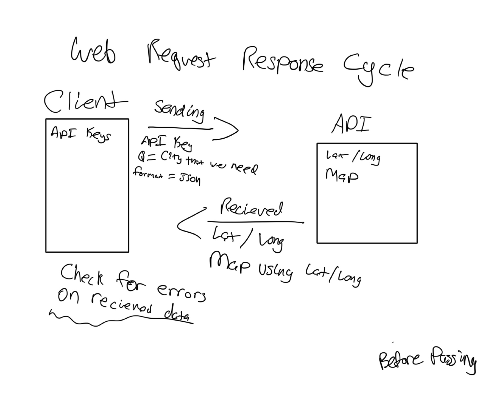

AWS GUI Deployed Link: http://cityexplorerapi-env.eba-8suumtzx.us-west-2.elasticbeanstalk.com/
AWS CLI Deployed Link: http://cityexplorergui-env-1.eba-kiizsfnk.us-west-2.elasticbeanstalk.com/

**Author**: Anthony Keith
**Version**: 1.0.0 (increment the patch/fix version number if you make more commits past your first submission)

## Overview
I wanted to build an app that took in a city from the user and generated a map

## Getting Started
Bootstrap
Axios
React
## Architecture
Used Bootstrap for components
Used Axios for API call

## Change Log
759: project works

Name of feature: Map

Estimate of time needed to complete: 3 hours

Start time: 1pm

Finish time: 8pm

Actual time needed to complete: 7 hours

WRRC 1: 

WRRC 2: 

WRRC 3: .jpg)
